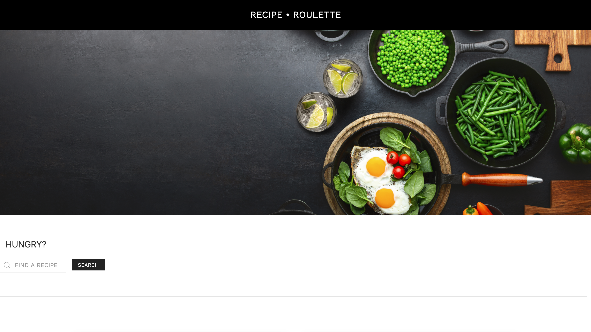
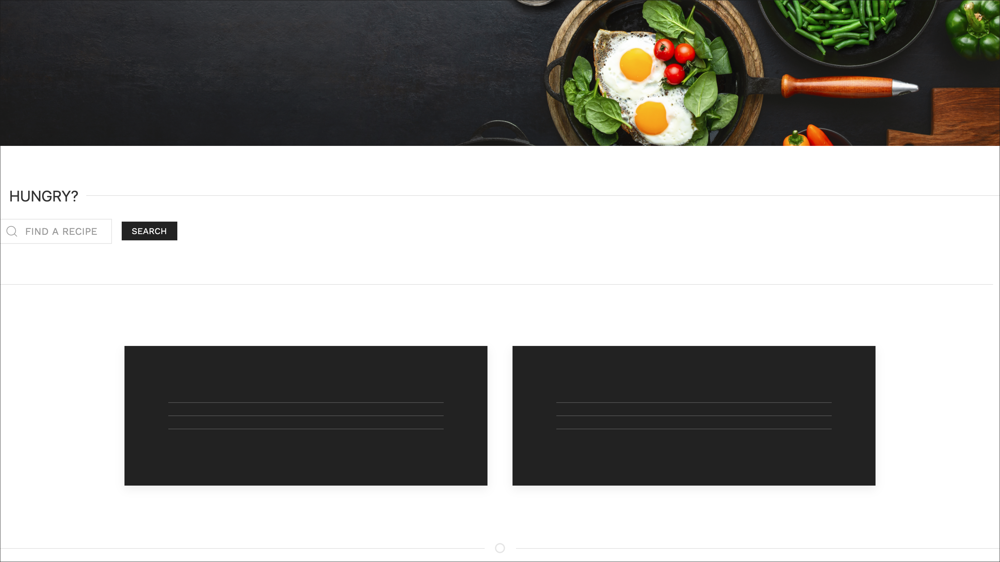
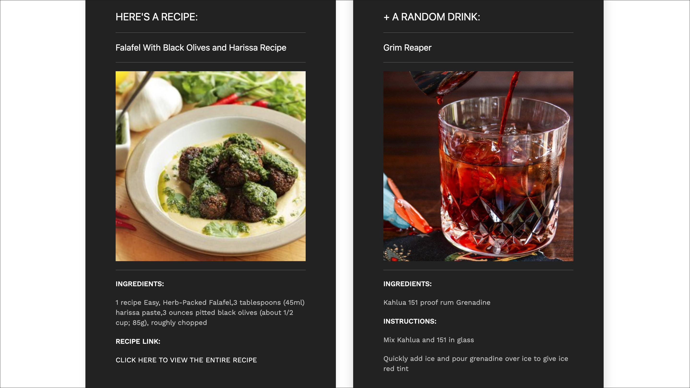

# Recipe Roulette

Recipe Roulette is a random recipe generating application created for anyone who has a general idea of a recipe they are interested in or an ingredient they would like a recipe for. The user enters a food item, clicks search, and the application returns a result containing that food item or requested recipe. As a bonus to the roulette, we provide the user with a randomly generated cocktail pairing. This is a fun feature, as this result is truly random. If the pairing seems odd, the user can search again and will be presented with another beverage option. When the user receives a random meal recipe result, they are provided with an overview of the ingredients involved and a clickable link which will direct them to the full recipe and cooking instructions in another browser tab. We enjoyed creating this random application, and even found a few interesting recipes ourselves in the process of development. Our goal was to create a user interface that is sleek, modern, and aesthetically pleasing. This application is mobile first, and features a responsive layout that is viewable on a large variety of device types. This project was built using a single HTML file, a single CSS file for styling, a single JavaScript file, and is also linked to the most recent jQuery CDN. For our CSS framework we utilized "UI KIT" by linking to their CDN (https://getuikit.com/). We pulled information for this project from two separate third party application programming interfaces. The first API named "EDAMAM" (https://developer.edamam.com/) which is extremely comprehensive and full of 1.7+ million recipes. The second API was a smaller project "TheCocktailDB" and is completely cocktail specific and has roughly 604 featured drinks (https://www.thecocktaildb.com/). We generated a food related favicon for this project and created it using Favic-O-Matic (https://favicomatic.com/). Our font, "Work Sans" was obtained via Google Fonts (https://fonts.google.com/specimen/Work+Sans).

&nbsp;

Recipe Roulette was designed for those who are looking to try something completely new for any meal of the day! 

&nbsp;

Deployed link:  https://albie140.github.io/Recipe-Roulette

---------------

&nbsp;

&nbsp;

----------------

&nbsp;

&nbsp;

----------------

&nbsp;

&nbsp;

----------------

&nbsp;

Collaborators:

Jonathan Schimpf,
Yazan Deek,
Alberte Laventure,
Ian Fusi